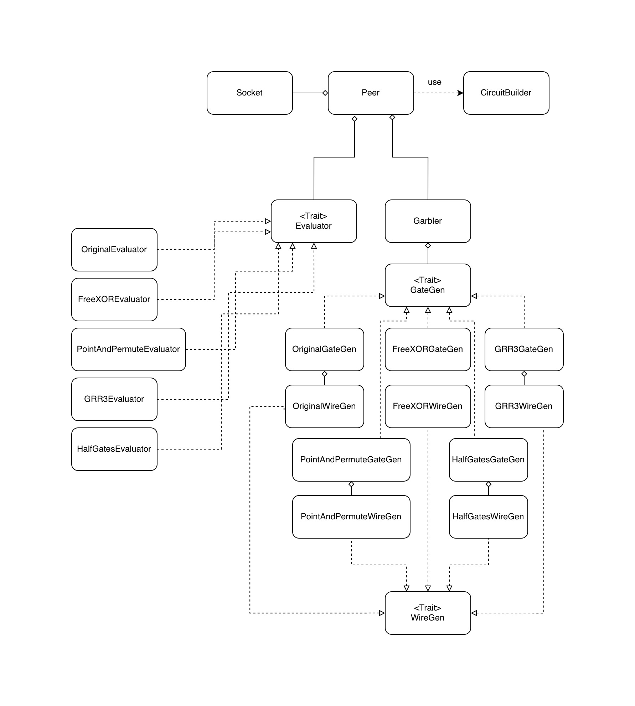
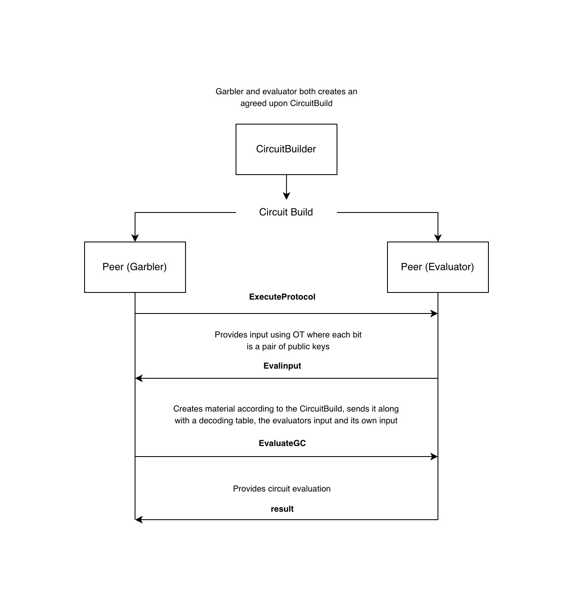

# GC_Machine
A Garbled Circuit (GC) implementation as a part of our masters thesis in Computer Science at Aarhus University. It implements several optimisations of the protocol originally proposed by Andrew Yao in 1986 ([Yao, 1986](https://doi.org/10.1109/SFCS.1986.25)), enabling two parties to jointly compute a function over their private inputs while revealing only the output.

The following GC optimisations are implemented: 
* [Point-and-Permute](https://doi.org/10.1145/100216.100287)

* [Garbled-Row-Reduction-3 (GRR3)](https://doi.org/10.1145/336992.337028)

* [Free-XOR](https://doi.org/10.1007/978-3-540-70583-3_40)

* [Half-Gates](https://eprint.iacr.org/2014/756)

* [Stacked Garbling](https://eprint.iacr.org/2020/973). 

## Quick start
The implementation is written purely in Rust meaning it requires [Rust](https://rustup.rs/).

#### Starting a Peer
`cargo run` starts a *Peer* with an already chosen input, ready to complete the GC protocol with another *Peer* over a network socket. In which way another *Peer* is found in practice and the function to compute is agreed upon, is unhandled.

A great way to see how the code works is by looking in `/tests/integration.rs`.

#### Chosing the function to compute
The function to compute is constructed using the `CircuitBuilder`. It defines the topology of the circuit. Esentially which gates has to be created and which wires to connect to them. It allows to use modular functianlity blocks of logic gates instead of having to connect logic gates manually. 

The following operations are available for now: 
* **Arithmetic:** Addition, Multiplication
* **Logical comparators:** equal
* **Conditionals:** Naively or [Stacked](https://eprint.iacr.org/2020/973)

It is possible to call the blocks in the `CircuitBuilder` directly but that can be tedious for more complicated circuits. Instead a descriptive language is available through a macro `#[circuit_fn]`. The macro is still experimental and currently supports only a subset of Rust syntax (for example, `for` loops are not yet supported).

```rust
#[circuit_fn]
fn produce_build(garbler_input: usize, evaluator_input: usize) -> usize {
    garbler_input + evaluator_input
}
```
and to retreive the build
```rust
let circuit_build = circuit!(produce_build);
```


## Tests and benchmarks
Correctness is verified using unit and integration tests with `cargo test`

It is also possible to benchmark each optimisation by running `cargo bench`. This will measure performance in communication and compute. Communication is measured as the raw bytes required for the garbled tables material. Compute is measured using [Criterion](https://docs.rs/criterion/latest/criterion/) and [perf](https://perfwiki.github.io/main/). Criterion statistically measures the time required to garble and evaluate. perf measures CPU instruction to garble and evaluate, but works only on Linux. 

The report will be available in `/target/criterion/report`. A python script is available to can construct a command line comparison report.
It can be run by starting a venv and then run `python parse_criterion.py` after.


The amount of gates and input can easily be changed in `bench.rs` such that circuits of all types can be measured. 


## Architecture
From a high level we mainly use three components. A `CircuitBuilder`, `Garbler` and an `Evaluator`.

The function to compute is instructed according to a `CircuitBuild` from the `CircuitBuilder`. A `Garbler` uses the `CircuitBuild` to know the topology of the circuit to produce, the gates to produce and the wires to connect to which gate. The material is sent in a specific order which the `Evaluator` knows using the same `CircuitBuild`. It allows the `Evaluator` to evaluate gates in the order of which their input wires are available and for the `Garbler` to only send the garbled tables - with no metadata. 

We adhered to a modular architecture using trait based components which can be set accordingly to which optimisation should be used. E.g. to use the Half Gates optimisation a `Peer` can be instantiated using a `Garbler<HalfGatesGateGen>` and a `HalfGatesEvaluator`.

#### Overview of the architecture: 


#### The GC protocol for the implementation. 

`CircuitBuild` can be created locally or in some other way agreed upon and exchanged. The circuit can also be precomputed before the OT phase. 


